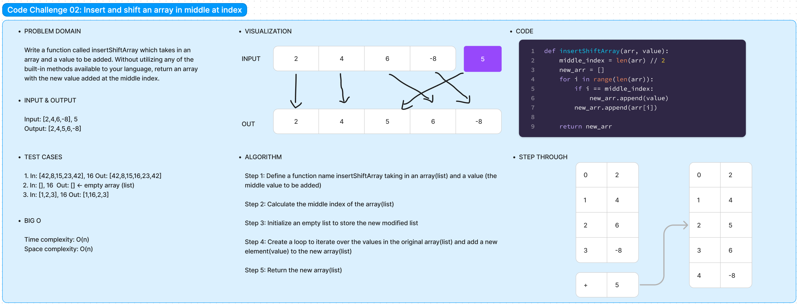

# Code Challenge 02:

Author: Danner Taylor

Write a function called insertShiftArray which takes in an array and a value to be added. Without utilizing any of the built-in methods available to your language, return an array with the new value added at the middle index.

## Whiteboard

## Approach & Efficiency

The insertShiftArray function takes an input array arr and a value value to be inserted. It calculates the middle index using integer division and then creates a new array new_arr to hold the modified elements. It iterates through the original array to construct the new array, appending the given value at the middle index. The function has a time complexity of O(n), where "n" is the number of elements in the input array, as it performs a single pass through the array. The space complexity is also O(n), as it avoids using any built-in methods or additional data structures. Overall, the implementation is both simple and efficient, making it suitable for practical use cases with arrays of varying sizes

## Solution

