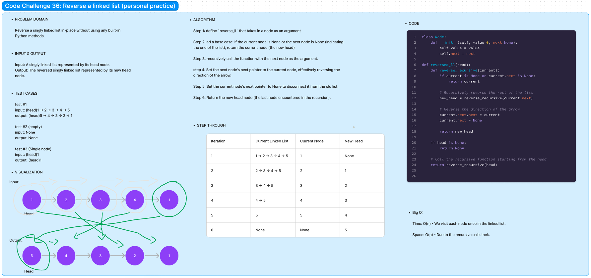

# Code Challenge 36:

Author: Danner Taylor

Reverse a singly linked list in-place without using any built-in Python methods.

## Whiteboard

## Approach & Efficiency

The approach used to reverse a singly linked list in this solution is a recursive one, which involves traversing the list while recursively reversing its body before re-connecting the head. This approach is efficient with a time complexity of O(n), where 'n' is the number of nodes in the list, as each node is visited once. However, it uses O(n) space on the call stack due to the recursive calls, which is important to consider for large lists but maintains an in-place solution.

## Solution
