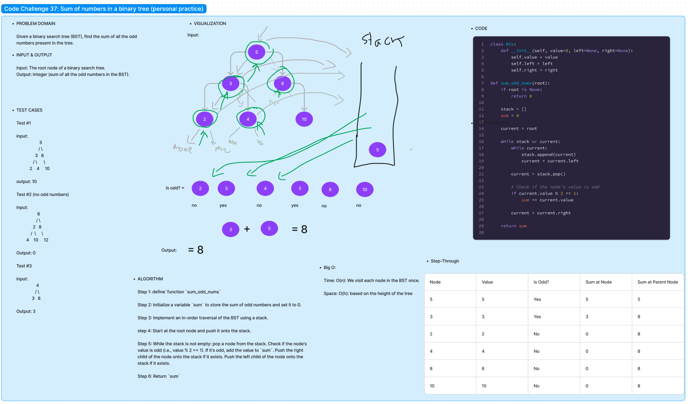

# Code Challenge 37:

Author: Danner Taylor

Given a binary search tree (BST), find the sum of all the odd numbers present in the tree.

## Whiteboard

## Approach & Efficiency

The approach of performing an in-order traversal of a binary search tree (BST) to find the sum of odd numbers is efficient and systematic. It ensures that nodes are visited in ascending order, and only odd nodes are added to the sum as they are encountered. This approach has a time complexity of O(n), where 'n' is the number of nodes in the BST, and a space complexity of O(h), where 'h' is the height of the BST. In the worst case (unbalanced tree), this could be O(n), and in the best case (balanced tree), it's O(log n).

## Solution
