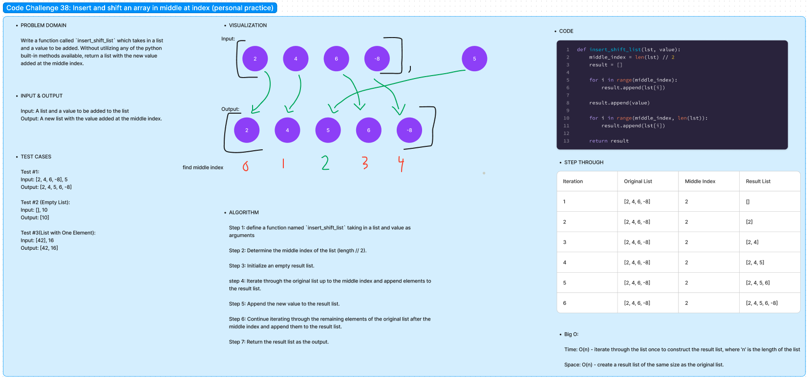

# Code Challenge 38:

Author: Danner Taylor

Write a function called `insert_shift_list` which takes in a list and a value to be added. Without utilizing any of the python built-in methods available, return a list with the new value added at the middle index.

## Whiteboard

## Approach & Efficiency

The approach of inserting a value into the middle of a list without using built-in methods is straightforward and efficient. It involves determining the middle index, creating a new list, and iteratively building the result list by inserting the value at the appropriate position. This approach has a time complexity of O(n) since it requires a single pass through the list, and a space complexity of O(n) due to the creation of a result list of the same size as the original list, making it a practical solution for list insertion.

## Solution
