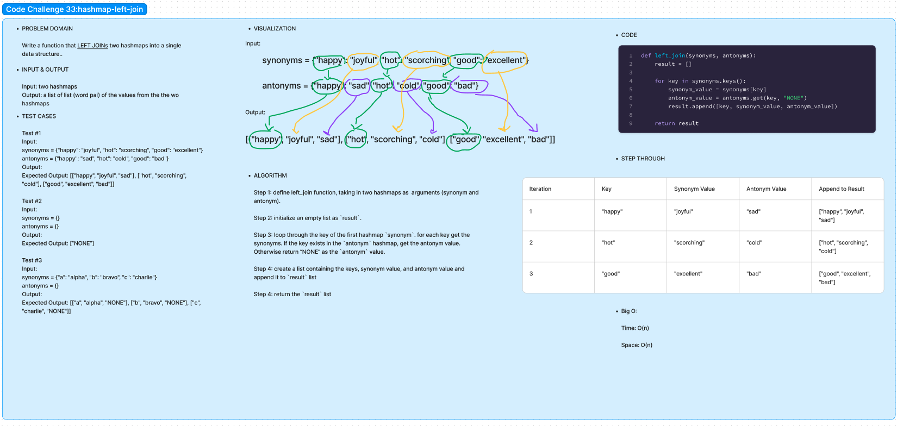

# Code Challenge 33:

Author: Danner Taylor

Write a function that LEFT JOINs two hashmaps into a single data structure.

## Whiteboard

## Approach & Efficiency

The left_join function takes two hashmaps as input, representing synonyms and antonyms, and efficiently combines them into a single data structure. It iterates through the keys of the synonyms dictionary and for each key, retrieves the synonym value and corresponding antonym value (if present). The function then constructs a list of lists containing the key, synonym, and antonym, resulting in an efficient time complexity of O(n), where n is the number of keys in the synonyms dictionary, and a space complexity of O(n) to store the result.

## Solution
