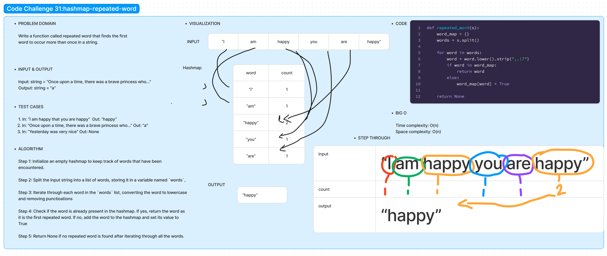

# Code Challenge 31:

Author: Danner Taylor

Write a function called repeated word that finds the first word to occur more than once in a string

## Whiteboard

## Approach & Efficiency

The approach for finding the first repeated word in a given string involves the use of a hashmap to keep track of words that have been encountered. The algorithm starts by splitting the input string into a list of words. It then iterates through each word.The time complexity of the algorithm is O(n), where `n` is the number of words in the input string. The space complexity is also O(n) due to the storage requirements of the hashmap. This makes the algorithm efficient and scalable for large input strings.

## Solution
