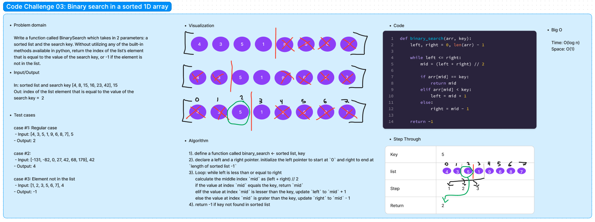

# Code Challenge 03

Author: Danner Taylor

Write a function called BinarySearch which takes in 2 parameters: a sorted list and the search key. Without utilizing any of the built-in methods available in python, return the index of the list’s element that is equal to the value of the search key, or -1 if the element is not in the list.

## Whiteboard

## Approach & Efficiency

The binary search function follows a divide-and-conquer approach to efficiently locate a target element in a sorted list. It repeatedly divides the search range in half, allowing it to eliminate half of the remaining elements with each step. This logarithmic reduction in the search space results in a time complexity of O(log n), where "n" is the number of elements in the list. The algorithm operates with a space complexity of O(1), utilizing a constant amount of memory regardless of input size. Overall, the binary search algorithm is highly efficient for locating elements in large sorted lists.

