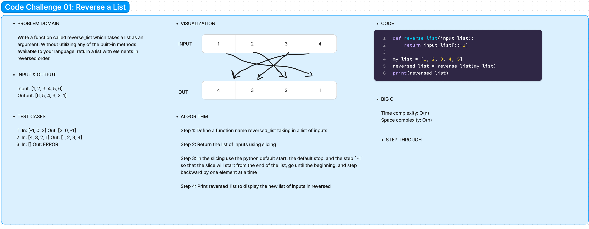

# Code Challenge 01: Reverse a List

Write a function called reverseArray which takes an array as an argument. Without utilizing any of the built-in methods available to your language, return an array with elements in reversed order.

## Whiteboard

## Approach & Efficiency

In this approach, slicing was used. Which allowed me to get the desired output with less line of code. This also allow the code to be more efficient.

## Solution
