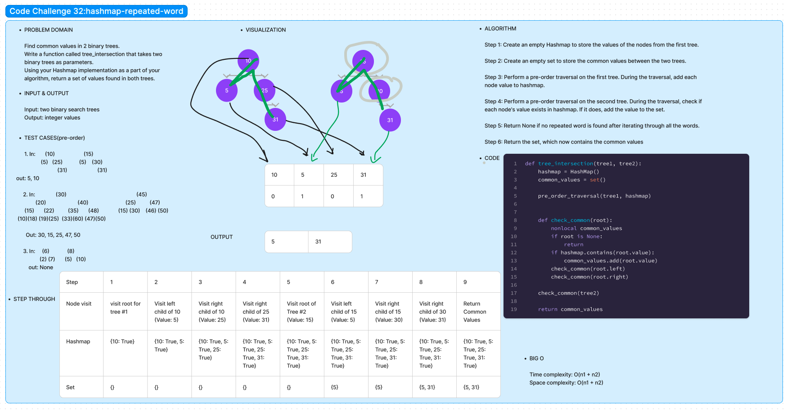

# Code Challenge 32:

Author: Danner Taylor

Find common values in 2 binary trees. 
Write a function called tree_intersection that takes two binary trees as parameters. 
Using your Hashmap implementation as a part of your algorithm, return a set of values found in both trees.

## Whiteboard

## Approach & Efficiency

This function employs a two-step approach to identify common values between two binary trees. First, it traverses the nodes of the first tree using pre-order traversal and stores each node's value in a Hashmap. This ensures constant-time lookups when checking for common values. Second, it traverses the nodes of the second tree, also using pre-order traversal, and checks if each node's value exists in the Hashmap. If it does, the value is added to a set of common values. This approach is efficient, with a time complexity of O(n1 + n2), AND THE space complexity is also O(n1 + n2)

## Solution
