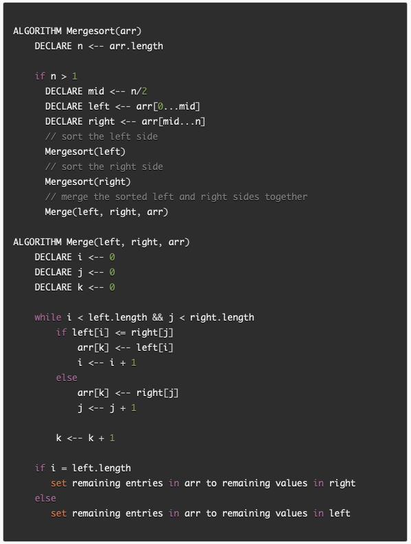
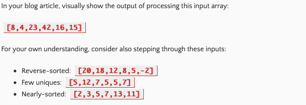
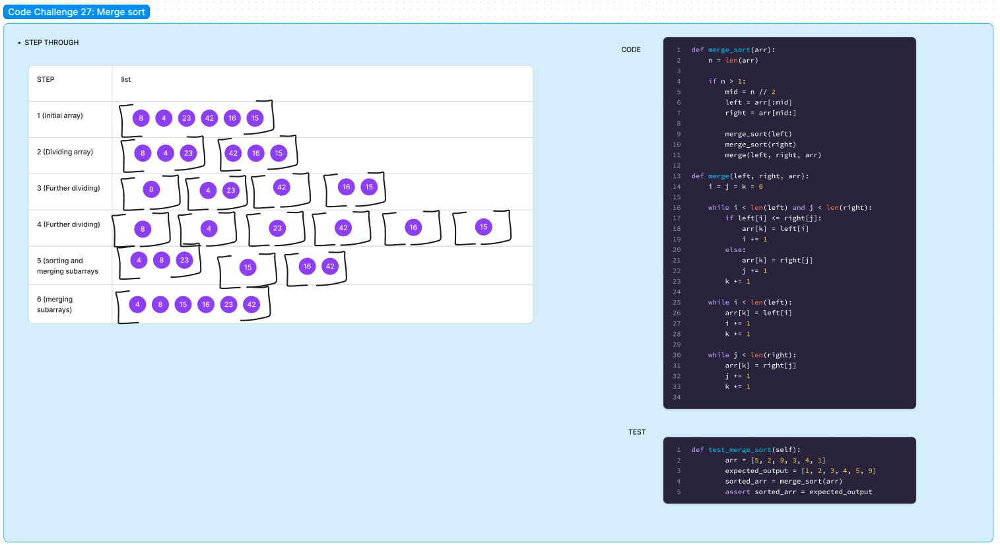

# Blog Notes: Merge Sort

Code Challenge: Class 27

Author: Danner Taylor

## Merge Sort

Review the pseudocode below, then trace the algorithm by stepping through the process with the provided sample array. Document your explanation by creating a blog article that shows the step-by-step output after each iteration through some sort of visual.

Once you are done with your article, code a working, tested implementation of Merge Sort based on the pseudocode provided.

### Pseudocode

### Sample Arrays

### Implementation

- Provide a visual step through for each of the sample arrays based on the provided pseudocode
- Convert the pseudocode into working code in your language
- Present a complete set of working tests

### Step Through Code with Test

